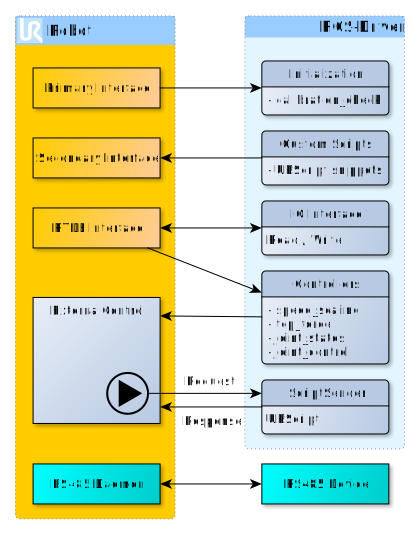

# Softrobot_TAS_UR10
This is the repository to controll the UR10 arms for the TAS project
This driver is forked and adapted fromt the 
[Universal_Robots_ROS_Driver](https://github.com/UniversalRobots/Universal_Robots_ROS_Driver)

Developed in collaboration between:

 and
 and
 and

This project has received funding from the UKRI
research and innovation programme under grant agreement no.???? 

## How to report an issue
Please contact Anthony Le (anthony.le@bristol.ac.uk)

## How to get help
If you need help using this driver, please contact Anthony Le (anthony.le@bristol.ac.uk)

# ur_robot_driver 

This package contains the actual driver for UR robots. It is part of the *universal_robots_driver*
repository and requires other packages from that repository. Also, see the [main repository's
README](../README.md) for information on how to install and startup this driver.

## ROS-API
The ROS API is documented in a [standalone document](doc/ROS_INTERFACE.md). It is auto-generated
using [catkin_doc](https://github.com/fzi-forschungszentrum-informatik/catkin_doc).

## Technical details
The following image shows a very coarse overview of the driver's architecture.

Upon connection to the primary interface the robot sends version and calibration information which
is consumed by the *calibration_check*. If the calibration reported by the robot doesn't match the
one configured (See [calibration guide](../ur_calibration/README.md)) an error will be printed to Roslog.

Real-time data from the robot is read through the RTDE interface. This is done automatically as soon
as a connection to the robot could be established. Thus joint states and IO data will be immediately
available.

To actually control the robot, a program node from the **External Control** URCap must be running on
the robot interpreting commands sent from an external source. When this program is not running, no
controllers moving the robot around will be available, which is handled by the
[controller_stopper](../controller_stopper/README.md). Please see the [initial setup
guide](../README.md) on how to install and start this on the robot.

The URScript that will be running on the robot is requested by the **External Control** program node
from the remote ROS PC. The robot *ur_control.launch* file has a parameter called `urscript_file` to
select a different program than the default one that will be sent as a response to a program
request.

**Custom script snippets** can be sent to the robot on a topic basis. By default, they will
interrupt other programs (such as the one controlling the robot). For a certain subset of functions,
it is however possible to send them as secondary programs. See [UR
documentation](https://www.universal-robots.com/how-tos-and-faqs/how-to/ur-how-tos/secondary-program-17257/)
on details.
 
**Note to e-Series users:**
The robot won't accept script code from a remote source unless the robot is put into
*remote_control-mode*. However, if put into *remote_control-mode*, the program containing the
**External Control** program node can't be started from the panel.
For this purpose, please use the **dashboard** services to load, start and stop the main program
running on the robot. See the [ROS-API documentation](doc/ROS_INTERFACE.md) for details on the
dashboard services.

For using the **tool communication interface** on e-Series robots, a `socat` script is prepared to
forward the robot's tool communication interface to a local device on the ROS PC. See [the tool
communication setup guide](doc/setup_tool_communication.md) for details.

This driver is using [ROS-Control](https://wiki.ros.org/ros_control) for any control statements.
Therefore, it can be used with all position-based controllers available in ROS-Control. However, we
recommend using the controllers from the `scaled_trajectory_controller` package. See its
[documentation](https://github.com/UniversalRobots/Universal_Robots_ROS_scaled_controllers/tree/main/scaled_joint_trajectory_controller) for details. **Note: Speed scaling support will only be
available using the controllers from `scaled_trajectory_controller`**

## A note about modes
The term **mode** is used in different meanings inside this driver.

### Remote control mode
On the e-series the robot itself can operate in different command modes: It can be either in **local control
mode** where the teach pendant is the single point of command or in **remote control mode**, where
motions from the TP, starting & loading programs from the TP activating the freedrive mode are
blocked. Note that the **remote control mode** has to be explicitly enabled in the robot's settings
under **Settings** -> **System** -> **Remote Control**. See the robot's manual for details.

The **remote control mode** is needed for many aspects of this driver such as
 * headless mode (see below)
 * sending script code to the robot
 * many dashboard functionalities such as
   * restarting the robot after protective / EM-Stop
   * powering on the robot and do brake release
   * loading and starting programs
 * the `set_mode` action, as it uses the dashboard calls mentioned above

### Headless mode
Inside this driver, there's the **headless** mode, which can be either enabled or not. When the
[headless mode](./doc/ROS_INTERFACE.md#headless_mode-default-false) is activated, required script
code for external control will be sent to the robot directly when the driver starts. As soon as
other script code is sent to the robot either by sending it directly through this driver or by
pressing any motion-related button on the teach pendant, the script will be overwritten by this
action and has to be restarted by using the
[resend_robot_program](./doc/ROS_INTERFACE.md#resend_robot_program-std_srvstrigger) service. If this
is necessary, you will see the output `Connection to robot dropped, waiting for new connection.`
from the driver. Note that pressing "play" on the TP won't start the external control again, but
whatever program is currently loaded on the controller. This mode doesn't require the "External
Control" URCap being installed on the robot as the program is sent to the robot directly. However,
we recommend to use the non-headless mode and leverage the `set_mode` action to start program
execution without the teach pendant. The **headless** mode might be removed in future releases.

**Note for the e-Series:** In order to leverage the **headless** mode on the e-Series the robot must
be in **remote_control_mode** as explained above.
